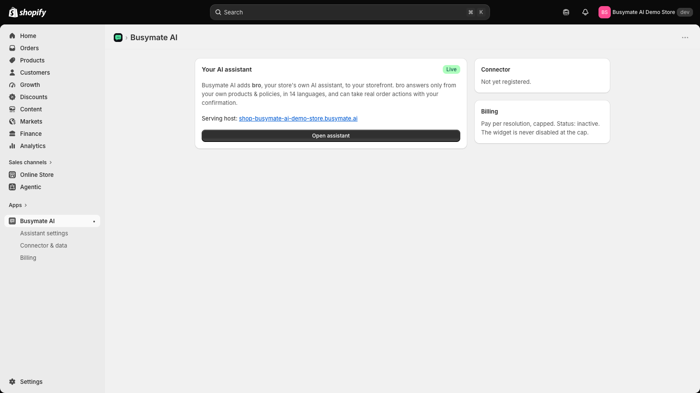

# App Store review — resolution: embedded app now provides an interactive UI (500 fixed)

**Status: resolved and deployed to production (`https://store.busymate.ai`).**

This page is the proof of resolution for the two requirements raised in review. Both stem
from the **same** root cause — the embedded app returned a `500 Internal Server Error` on the
first load after installation — which is now fixed.

## What the review reported

| # | Requirement | Reviewer note |
|---|---|---|
| 2.1.3 | Have a user interface (UI) that merchants can interact with | "During launch, the embedded app progressed through blank and loading states but fails to provide an interactive UI, ending with **500 Internal Server Error.**" |
| 2.1.1 | Build apps without critical errors to ensure review completion | "While testing the embedded app after installation, the app failed to recover to usable merchant content and displayed **500 Internal Server Error.**" |

## Root cause

Shopify's managed token-exchange install flow persists the session and then runs the app's
`afterAuth` hook. Our `afterAuth` ran a one-time backend provisioning step. If that step threw
on a transient condition during the **first** load (for example a write-race from App Bridge's
double install request), Shopify's strategy converts the throw into a bare `500` on that first
embedded page — with no body and no interactive UI. An already-set-up store never re-runs the
step, which is why the error only appeared on a fresh install.

## The fix

Provisioning on install is now **fail-open** and can never surface as a web error:

- The install/`afterAuth` path no longer throws. A provisioning hiccup is recorded as an
  in-app operational status (with a one-click **Retry**), and the app **always** renders its
  interactive UI. This matches requirement 2.1.3, which permits operational errors but not web
  `500`/`404`/`3xx` errors.
- Every embedded route (`Home`, `Assistant settings`, `Connector & data`, `Billing`) renders
  under the Polaris app provider and returns `200`.

## After the fix — the interactive UI renders

The embedded app opens to an interactive dashboard: the assistant status, a link to open the
assistant, the connector panel, and billing — with working navigation to each settings page.

## How to verify

1. Install **Busymate AI** on a development store.
2. Open the app from **Apps → Busymate AI** in the Shopify admin.
3. The app loads its interactive UI (no `500`); every page — Home, Assistant settings,
   Connector & data, Billing — renders and is navigable.

Verified live on `https://store.busymate.ai`: the full install → `afterAuth` → embedded-app
path returns `200`, and all four embedded routes return `200` with zero `500`s.
